<div align="center">
  
</div>

<div align="center">

# Gabriel Angelo Catimbang


[](https://www.linkedin.com/in/gabrielcatimbang)
[](https://github.com/gab-cat)
[](mailto:catimbanggabriel@gmail.com)


---
<div align="center">
  <div style="display: flex; justify-content: center; align-items: center; gap: 20px; flex-wrap: wrap;">
    
    
  </div>
</div>


</div>

---

## About Me

Building secure, scalable digital solutions with a focus on **DevSecOps**, **full-stack development**, and **cloud architecture**. Currently serving as **Webmaster at ThePILLARS Publication**, where I lead infrastructure deployments, implement CI/CD pipelines, and optimize system performance.

**Core Expertise:**
- DevSecOps implementation and security automation
- Cloud architecture design and deployment (AWS, Docker)
- Full-stack web application development
- Cybersecurity and penetration testing
- System administration and performance optimization

---

## Repository Highlights

<div align="center">

[](https://github.com/gab-cat/merchtrack)
[](https://github.com/gab-cat/merchtrack-mobile)

[](https://github.com/gab-cat/web-portfolio)
[](https://github.com/gab-cat/next-recipe)

</div>

---

## Professional Experience

**Software Developer Intern** @ *Old.St Labs* `Jun 2025 – Present`  
Developing modern web applications using full-stack technologies. Contributing to scalable solutions with cloud-native architecture and database optimization.

**Tech Stack:**  


**Webmaster** @ *ThePILLARS Publication* `Jul 2024 – Present`  
Architect and deploy cloud-based infrastructure using Docker, AWS, and CI/CD pipelines. Manage project development lifecycles with Kanban methodology and enforce comprehensive DevSecOps practices.

**Tech Stack:**  


**Web Developer** @ *ThePILLARS Publication* `Jun 2024 – Jul 2024`  
Built full-stack applications with Nuxt3, Express.js, and MongoDB. Focused on security implementation and deployment efficiency optimization.

**Tech Stack:**  


**Frontend Developer Apprentice** @ *ThePILLARS Publication* `Jan 2024 – Jun 2024`  
Contributed to modern web projects using Vue.js and Nuxt3, emphasizing responsive design and user experience optimization.

**Tech Stack:**  


**Lead Game Programmer** @ *ADNU Game Development Camp* `Jun 2024 – Jul 2024`  
Led development of core gameplay systems using Unreal Engine. Coordinated agile sprints and iterative design processes.

**Tech Stack:**  


**Customer Service Agent** @ *Bell Canada (Quantrics Enterprises)* `May 2022 – Present`  
Delivered exceptional service in high-volume environment. Achieved 4x Bell All Star awards while maintaining dual chat operations and complex issue resolution.

**Tech Stack:**  


---

## Featured Project

### **MerchTrack - Ultimate Merchandise Management**

[](https://merchtrack.tech)
[](https://github.com/gab-cat/merchtrack)

> Launched March 2025 | **2,750+ users** in first week

A comprehensive university-focused e-commerce platform that revolutionized campus merchandise management with streamlined operations and enhanced user experience.

**Impact Metrics:**
- **2,750+ unique users** achieved within 7 days of launch
- **300% increase** in order processing efficiency
- **85% reduction** in customer support response time
- **96% customer satisfaction** rating

**Technology Stack:**  


**Key Features:**
- Secure authentication and authorization system
- Real-time payment processing with Stripe
- Cross-platform mobile application
- Advanced analytics and reporting dashboard
- Scalable microservices architecture

---
## Technology Stack

### System Administration and DevOps
<div align="left">
  
  
  
  
  
  
  
  
  
  
  
  
  
  
  
  
  
</div>

### Cloud Platforms

<div align="left">
  
  
  
  
  
  
  
  
  
</div>

### Front-End Development

<div align="left">
  
  
  
  
  
  
  
  
  
  
  
  
  
  
  
</div>

### Back-End Development

<div align="left">
  
  
  
  
  
  
  
  
  
  
  
</div>

### Databases

<div align="left">
  
  
  
  
  
  
  
  
  
  
  
</div>

### Tools and Platforms

<div align="left">
  
  
  
  
  
  
  
  
  
</div>

### Game Development

<div align="left">
  
  
  
  
  
  
  
  
  
</div>

###

---

## 🏆 Achievements & Recognition

<div align="center">

### 🥇 Competition Excellence


</div>

<div align="center">
  <table>
    <tr>
      <td align="center" width="300">
        
        <h4>3rd Annual Regional HackForGov CTF</h4>
        <p><strong>DICT - Region V</strong><br/>September 2024</p>
        <p>🥇 Led team to victory in cybersecurity competition<br/>🔐 Expertise in web exploitation & incident response</p>
      </td>
      <td align="center" width="300">
        
        <h4>3rd National HackForGov CTF</h4>
        <p><strong>DICT - CERT/NCERT</strong><br/>October 2024</p>
        <p>🏅 Ranked 5th out of 80 participants nationwide<br/>🛡️ Advanced cybersecurity problem-solving</p>
      </td>
      <td align="center" width="300">
        
        <h4>Bell All Star Winner</h4>
        <p><strong>Bell Canada</strong><br/>2022-2024</p>
        <p>🌟 Top 10% performance across 4 periods<br/>💼 Excellence while maintaining full-time studies</p>
      </td>
    </tr>
  </table>
</div>

<div align="center">

### 📊 Achievement Impact Visualization
```
Competition Performance:
████████████████████████████████████████ 100% Regional Champion
████████████████████████████████████     94%  National Top 5
████████████████████████████████████████ 100% Consistent Excellence

Skills Demonstrated:
🔐 Cybersecurity     ████████████████████████████████████████ 95%
💻 Problem Solving   ████████████████████████████████████████ 98%
👥 Team Leadership   ████████████████████████████████████████ 92%
⚡ Performance       ████████████████████████████████████████ 96%
```

</div>

---

## 📚 Certifications & Learning Journey

<div align="center">


</div>

<div align="center">
  <table>
    <tr>
      <th>🏢 Provider</th>
      <th>📜 Certification</th>
      <th>📅 Completed</th>
      <th>🎯 Focus Area</th>
    </tr>
    <tr>
      <td></td>
      <td><strong>GitHub Foundations</strong></td>
      <td>Dec 2024</td>
      <td>🔧 DevOps</td>
    </tr>
    <tr>
      <td></td>
      <td><strong>MongoDB Node.js Developer Path</strong></td>
      <td>Dec 2024</td>
      <td>🗄️ Database</td>
    </tr>
    <tr>
      <td></td>
      <td><strong>Master Nuxt 3: Full-Stack Guide</strong></td>
      <td>Dec 2024</td>
      <td>🌐 Frontend</td>
    </tr>
    <tr>
      <td></td>
      <td><strong>Docker for DevOps - Hands On</strong></td>
      <td>2024</td>
      <td>☁️ Cloud</td>
    </tr>
    <tr>
      <td></td>
      <td><strong>Unreal Engine 5: Soulslike Combat</strong></td>
      <td>2024</td>
      <td>🎮 Game Dev</td>
    </tr>
    <tr>
      <td></td>
      <td><strong>Power BI Advanced Analytics</strong></td>
      <td>2024</td>
      <td>📊 Analytics</td>
    </tr>
  </table>
</div>

<div align="center">

### 🎯 Certification Categories


</div>

---

## 🚀 Current Focus & Innovation

<div align="center">


</div>

### 🎯 Active Development Projects

<div align="center">
  <table>
    <tr>
      <td width="50%" align="center">
        
        <h4>🚀 Scaling MerchTrack</h4>
        <p>Implementing advanced analytics and AI-powered recommendations</p>
        <div>
          
          
        </div>
      </td>
      <td width="50%" align="center">
        
        <h4>🛡️ Security Research</h4>
        <p>Developing automated security testing frameworks</p>
        <div>
          
          
        </div>
      </td>
    </tr>
    <tr>
      <td width="50%" align="center">
        
        <h4>🏗️ Cloud Architecture</h4>
        <p>Building multi-region, fault-tolerant systems</p>
        <div>
          
          
        </div>
      </td>
      <td width="50%" align="center">
        
        <h4>🔥 Mobile Innovation</h4>
        <p>Creating next-generation cross-platform applications</p>
        <div>
          
          
        </div>
      </td>
    </tr>
  </table>
</div>

### 🌱 Learning & Growth Path

```mermaid
graph LR
    A[🤖 AI/ML Integration] --> B[🔐 Advanced Security]
    B --> C[📊 Data Engineering]
    C --> D[🎨 Design Systems]
    D --> E[🚀 Innovation]
    
    style A fill:#ff6b35
    style B fill:#4285f4
    style C fill:#00d084
    style D fill:#8b5cf6
    style E fill:#ffd700
```

<div align="center">




</div>

---

## 🤝 Connect & Collaborate

<div align="center">


### 💡 Let's Build Something Amazing Together

<table>
  <tr>
    <td align="center" width="200">
      
      <p>Cutting-edge solutions</p>
    </td>
    <td align="center" width="200">
      
      <p>Security-first development</p>
    </td>
    <td align="center" width="200">
      
      <p>Latest technologies</p>
    </td>
  </tr>
</table>

### 📬 Professional Networks

[](https://www.linkedin.com/in/gabrielcatimbang)
[](mailto:catimbanggabriel@gmail.com)
[](https://github.com/gab-cat)

### 🌐 Response Time


</div>

---

<div align="center">


</div>
